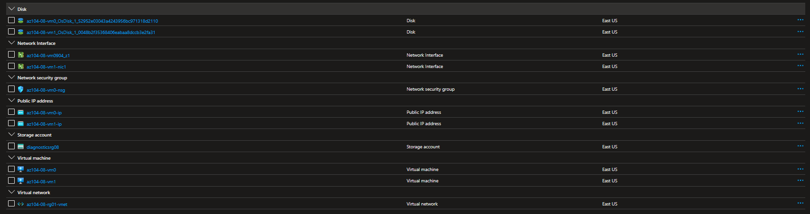

---


#[Lab 08 - Manage Virtual Machine](https://github.com/MicrosoftLearning/AZ-104-MicrosoftAzureAdministrator/blob/master/Instructions/Labs/LAB_08-Manage_Virtual_Machines.md)

You were tasked with identifying different options for deploying and configuring Azure virtual machines. First, you need to determine different compute and storage resiliency and scalability options you can implement when using Azure virtual machines. Next, you need to investigate compute and storage resiliency and scalability options that are available when using Azure virtual machine scale sets. You also want to explore the ability to automatically configure virtual machines and virtual machine scale sets by using the Azure Virtual Machine Custom Script extension.


---

1. Deployed zone-resilient Azure virtual machines by using the Azure portal and an Azure Resource Manager template

Using the portal and templating we get our VMs in different zones


**Complete provisioning**

ToDo:
  - What is zone resilient VM ?
  - Zoning
---
2. Configured Azure virtual machines by using virtual machine extensions

Using cloud storage to save and run scripts and also using templates to update VMs


**Successfull delpoyment of the script**

ToDO:
- Use cases for storage/contaiers
- What is the difference between using pwsh run script and using extensions
- Using templates to update a VM

---

3. Scaled compute and storage for Azure virtual machines

Using Azure portal to add disks and merging theme via pwsh command

\
**Setting up vm0**
   
Doing the same to vm1, but using the export template method.

```json
                "dataDisks": [
                   {
                     "lun": 0,
                     "name": "az104-08-vm1-datadisk0",
                     "diskSizeGB": "1024",
                     "caching": "ReadOnly",
                     "createOption": "Empty"
                   },
                   {
                     "lun": 1,
                     "name": "az104-08-vm1-datadisk1",
                     "diskSizeGB": "1024",
                     "caching": "ReadOnly",
                     "createOption": "Empty"
                   }
                 ]
```
**snippet from the template**


And we do the same with powershell for vm1


---

4. Deployed zone-reslient Azure virtual machine scale sets by using the Azure portal
  
  ```powershell
Register-AzResourceProvider -ProviderNamespace Microsoft.Insights

ProviderNamespace : microsoft.insights
RegistrationState : Registered
ResourceTypes     : {components, components/query, components/metadata, components/metrics…}
Locations         : {East US, South Central US, North Europe, West Europe…}
```

```powershell
Register-AzResourceProvider -ProviderNamespace Microsoft.AlertsManagement

ProviderNamespace : Microsoft.AlertsManagement
RegistrationState : Registered
ResourceTypes     : {alerts, alertsSummary, smartGroups, smartDetectorAlertRules…}
Locations         : {global, North Central US, East US, East US 2…}
```

ToDo:
- what is ms.insights
- what is ms.alertsManagment

---

5. Configured Azure virtual machine scale sets by using virtual machine extensions
   
   
   **Getting the machine up and running**
ToDo:
- research NIC security groups inboud/outbound rules

---

6. Configured Azure virtual machine scale sets by using virtual machine extensions


   
   **upgrading the vm instances**

  
  **Name of one of the instances**


ToDo:
- research scale instances 

---

7. Scaled compute and storage for Azure virtual machine scale sets

   
   **changing size**

|Instance      |Zone      |
|--------------|----------|
|az10408vmss0_0 |   1     |
|az10408vmss0_1 |   2     |


For some reason powershell doesn't find rg02, but we can get the ip manually 


**Powershell issues**

Doing a http request test to see the scaling in action

**Successfully scaling  to 3 VMs**

Runing a script to partition the newly added disks
```powershell
./az104-08-configure_VMSS_disks.ps1

```

ToDo:
- How to setup scaling

---