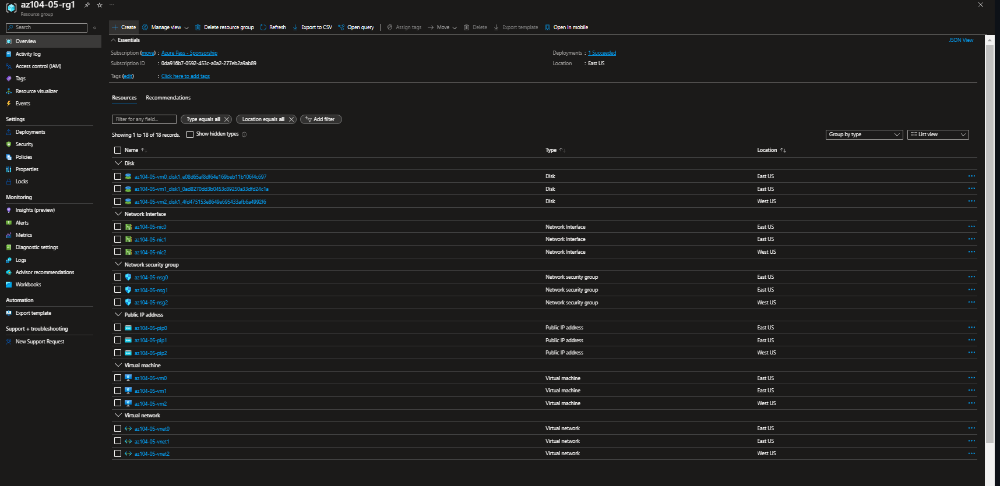

---

#[ Lab 05 - Implement Intersite Connectivity](https://github.com/MicrosoftLearning/AZ-104-MicrosoftAzureAdministrator/blob/master/Instructions/Labs/LAB_05-Implement_Intersite_Connectivity.md) 

Contoso has its datacenters in Boston, New York, and Seattle offices connected via a mesh wide-area network links, with full connectivity between them. You need to implement a lab environment that will reflect the topology of the Contoso's on-premises networks and verify its functionality.

---
1. Provisioned the lab environment


**Provisioning in different locations**


ToDo:

---

2. Configured local and global virtual network peering


**Using topology tool to show peerings**

ToDo:

---

3. Tested intersite connectivity


**Test conection from vm0 to vm1**
```powershell
 Test-NetConnection -ComputerName 10.51.0.4 -Port 3389 -InformationLevel 'Detailed'


ComputerName            : 10.51.0.4
RemoteAddress           : 10.51.0.4
RemotePort              : 3389
NameResolutionResults   : 10.51.0.4
MatchingIPsecRules      :
NetworkIsolationContext : Internet
InterfaceAlias          : Ethernet
SourceAddress           : 10.50.0.4
NetRoute (NextHop)      : 10.50.0.1
TcpTestSucceeded        : True
```


**Test conection from vm0 to vm2**
```powershell

Test-NetConnection -ComputerName 10.51.0.4 -Port 3389 -InformationLevel 'Detailed'


ComputerName            : 10.51.0.4
RemoteAddress           : 10.51.0.4
RemotePort              : 3389
NameResolutionResults   : 10.51.0.4
MatchingIPsecRules      :
NetworkIsolationContext : Internet
InterfaceAlias          : Ethernet
SourceAddress           : 10.50.0.4
NetRoute (NextHop)      : 10.50.0.1
TcpTestSucceeded        : True
```


**Test conection from vm1 to vm2**

```powershell
Test-NetConnection -ComputerName 10.52.0.4 -Port 3389 -InformationLevel 'Detailed'


ComputerName            : 10.52.0.4
RemoteAddress           : 10.52.0.4
RemotePort              : 3389
NameResolutionResults   : 10.52.0.4
MatchingIPsecRules      :
NetworkIsolationContext : Internet
InterfaceAlias          : Ethernet
SourceAddress           : 10.51.0.4
NetRoute (NextHop)      : 10.51.0.1
TcpTestSucceeded        : True
```


---

