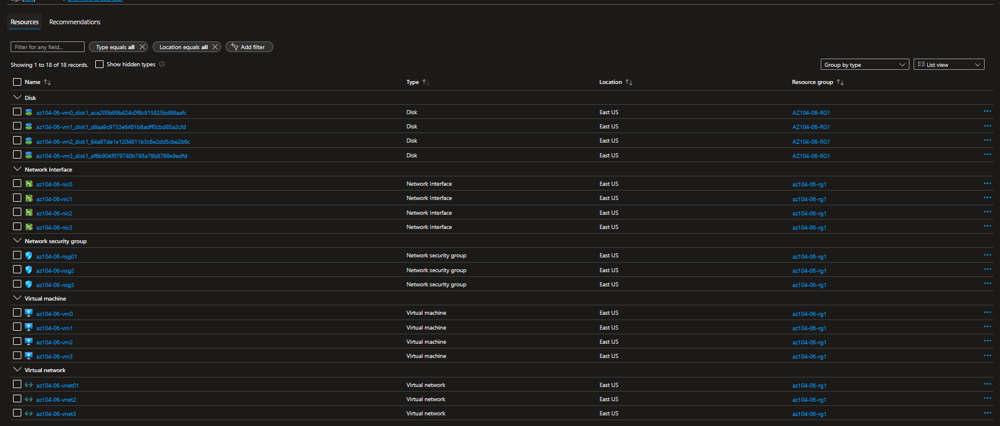
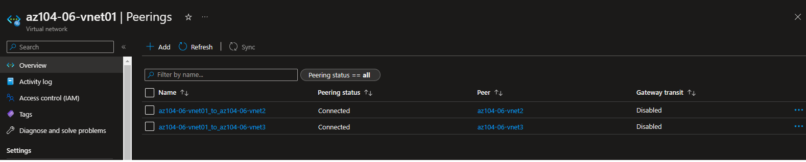
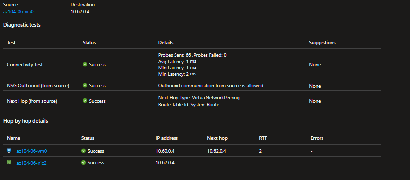
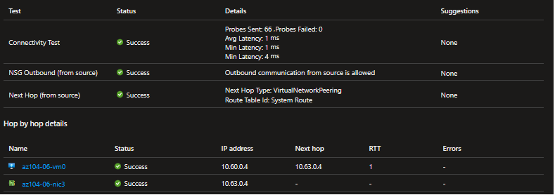
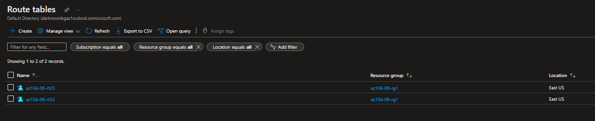
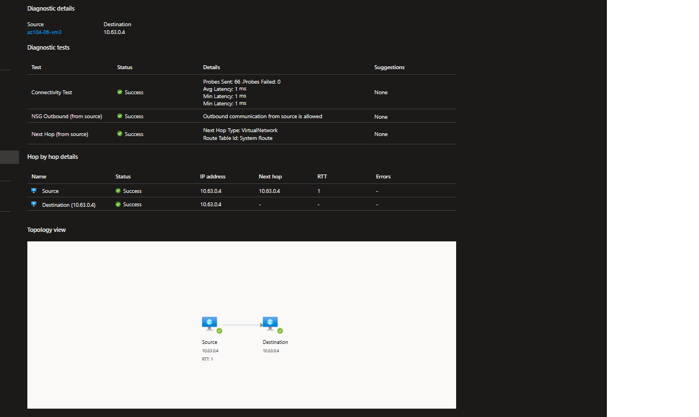
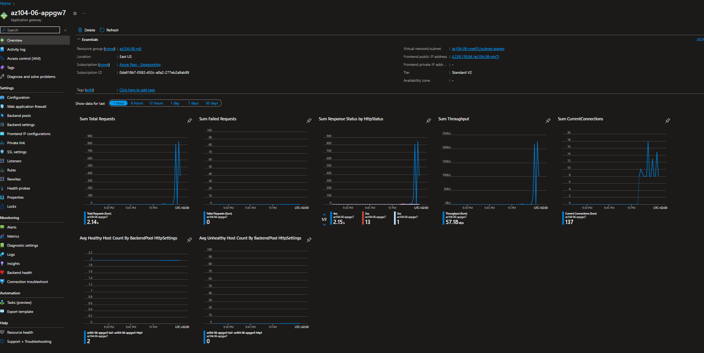
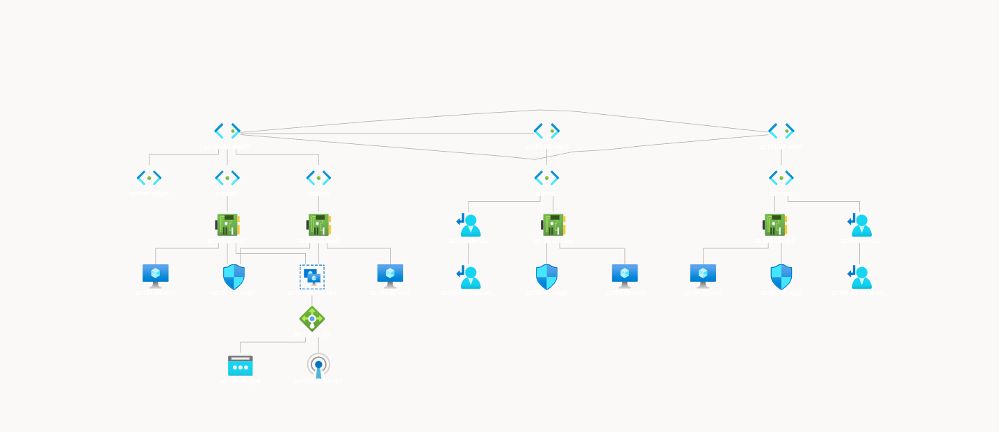

---

# [Lab 06 - Implement Traffic Management](https://github.com/MicrosoftLearning/AZ-104-MicrosoftAzureAdministrator/blob/master/Instructions/Labs/LAB_06-Implement_Network_Traffic_Management.md)

You were tasked with testing managing network traffic targeting Azure virtual machines in the hub and spoke network topology, which Contoso considers implementing in its Azure environment (instead of creating the mesh topology, which you tested in the previous lab). This testing needs to include implementing connectivity between spokes by relying on user defined routes that force traffic to flow via the hub, as well as traffic distribution across virtual machines by using layer 4 and layer 7 load balancers. For this purpose, you intend to use Azure Load Balancer (layer 4) and Azure Application Gateway (layer 7).

---

1. Lab provisioning with ARM templates



ToDo:
- Read on cli provisions
- Check ARM templates

---

2. Configured network
  


ToDo: 
- What a is hub/spoke topolgy
- Peerings

---
3. Transivity test 

  Testing connection between vm0 and vm2

  

  Testing connection between vm0 and vm3

  


ToDo:
- What is transivity -> Node interconnectivity
-  research network watcher functionality

---
 4. Configure routing in the hub and spoke topology
 - Enabling IP forwarding on vm0's nic0 and runing powershell

```powershell
Install-WindowsFeature RemoteAccess -IncludeManagementTools

---

Install-WindowsFeature -Name Routing -IncludeManagementTools -IncludeAllSubFeature

Install-WindowsFeature -Name "RSAT-RemoteAccess-Powershell"

Install-RemoteAccess -VpnType RoutingOnly

Get-NetAdapter | Set-NetIPInterface -Forwarding Enabled
```

We now have the hub, time to make the spokes




 ToDo: Get a new screenshot with a test, this one is wrong

---
5. Load balancer

ToDo:
- missing screenshots for some reason
- research load balancer settings 
---
6. Application gateway spoke

Load testing the gateway with LOIC (+2k requests)



ToDo:
- Application gateway vs Load balancer
- Add more steps


---

7. Network topology

Using the topology tool in Network watcher. Application gateway is missing or it might be hidden.



ToDo:
- Check the new topology tool
- Add text