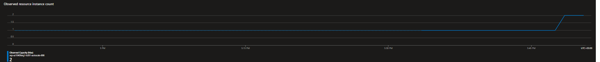
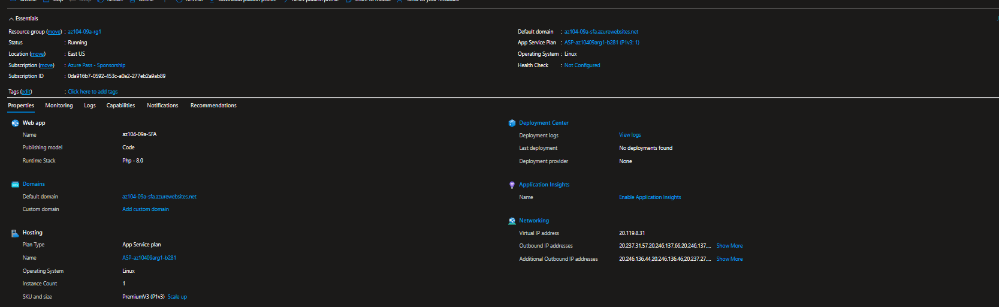
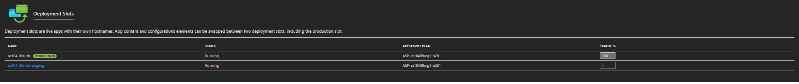
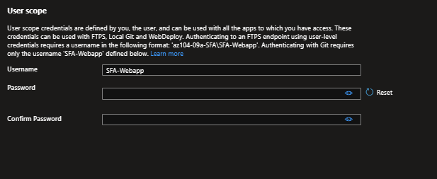
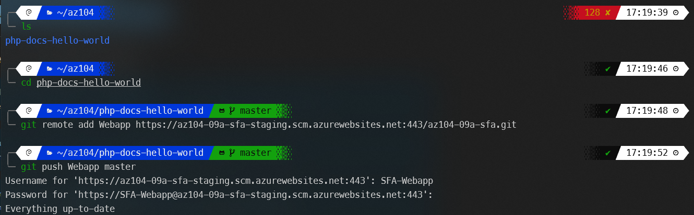
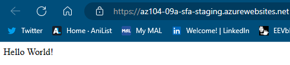
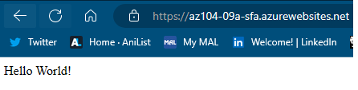

---

# [Lab 09a Implement Web Apps](https://microsoftlearning.github.io/AZ-104-MicrosoftAzureAdministrator/Instructions/Labs/LAB_09a-Implement_Web_Apps.html)

You need to evaluate the use of Azure Web apps for hosting Contoso’s web sites, hosted currently in the company’s on-premises data centers. The web sites are running on Windows servers using PHP runtime stack. You also need to determine how you can implement DevOps practices by leveraging Azure web apps deployment slots.

---

**Scaling out**

---

1. Created an Azure web app
   
2. Created a staging deployment slot
   
   **Getting the stages ready**
  ToDo:
  - Use case/project for test

---

3. Configured web app deployment settings
   
   **Setting user name and password**

---

4. Deployed code to the staging deployment slot
    
    **Pushing code from WSL**

   
   **Hello from staging**

---

5. Swapped the staging slots
   
   **Hello from prod**

   ---

6. Configured and test autoscaling of the Azure web app
   
 