# Kubernetes

---


# Notes

Runing a local cluster based on ARM processors doesn't work

---


1. Simple pods operations:

No pods available after querying 

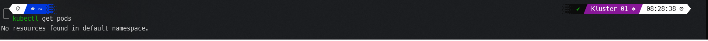

---

While using --all-namespaces we see pods(21) under the kube-system namespace. These pods are made and owned by the cluster - basically services that make using k8s possible 
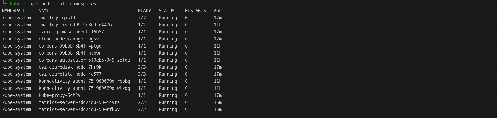

---

Afte executing *kubectl run nginx --image=nginx* and querying the pod is runing and well.
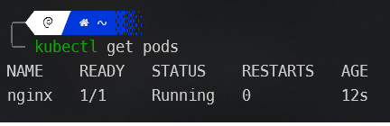  

---

Runing *logs* gives information about the pod - version, process status etc
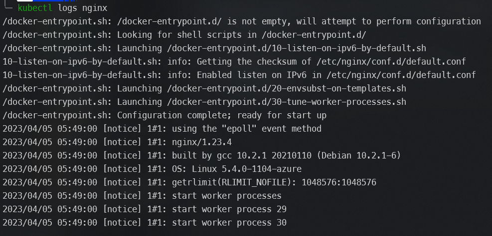  

---

Using *-o wide* gives us more information including the node where the pod is running
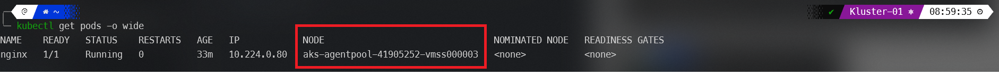  

---

Using *describe* gives us a detailed state of a pod
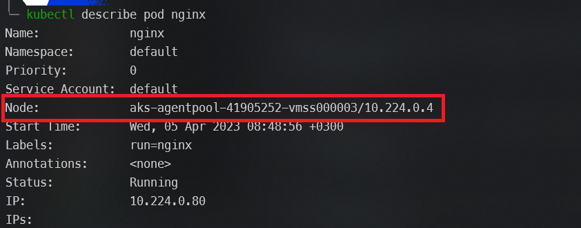

---

Container Image is pulled from a microsoft repository or better know as Microsoft Artifact Registry
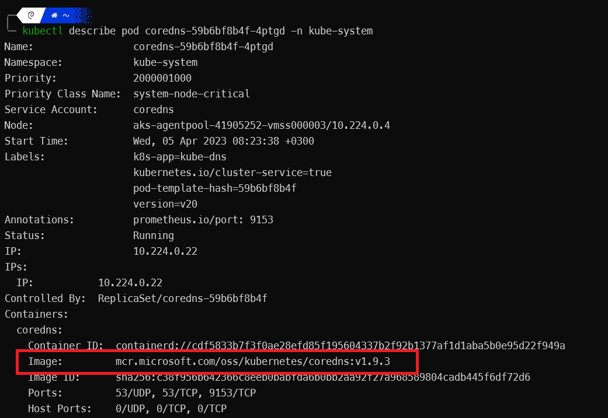

---

Logs from the metrics container - Errors aren't errors but information(go figure MS logging system)

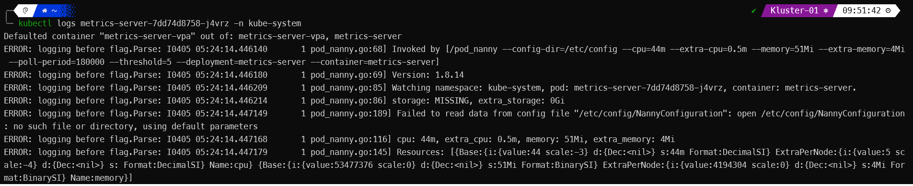

ToDo:
- What is a pod_nany

---


2. Working with pod manifest files:

For the sake of being brief I'll compare both files - wrong and correct versions.
- apiVersion is wrong for pods should be v1 not v11
- Formatting isn't according to yaml standard
- it's spec, not specs - typo
- image redis123 doesn't exist(we get a pull image error), we should check the image repo(Docker hub) for proper naming/version

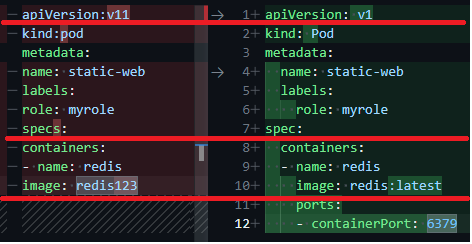

---

First run and we get a parsing error
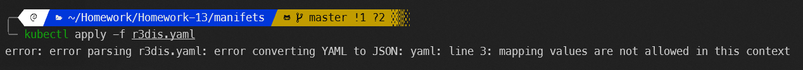

---

After the file has been corrected we get another error this time because of the image name

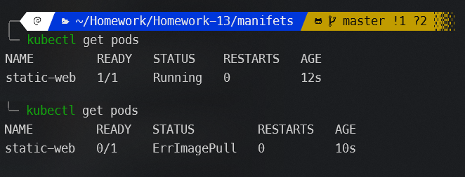

---

And here we have a healthy pod with a container.
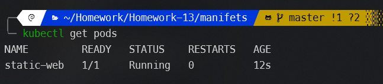


---

nginx manifest
```yaml

apiVersion: v1
kind: Pod
metadata:
  name: nginx-pod
  labels:
    app: frontend
spec:
  containers:
  - name: nginx-container
    image: nginx
    ports:
    - containerPort: 80


```

---

Memecache manifest

```yaml
apiVersion: v1
kind: Pod
metadata:
  name: memcached-pod
  labels:
    app: web
spec:
  containers:
  - name: memcached-container
    image: memcached
    ports:
    - containerPort: 11211
    resources:
      requests:
        cpu: 350m
        memory: 150Mi
      limits:
        cpu: 500m
        memory: 250Mi
    restartPolicy: Never
  ```

  Both nignx and memcache running 
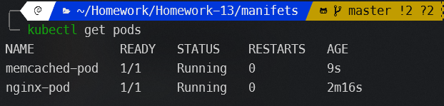


