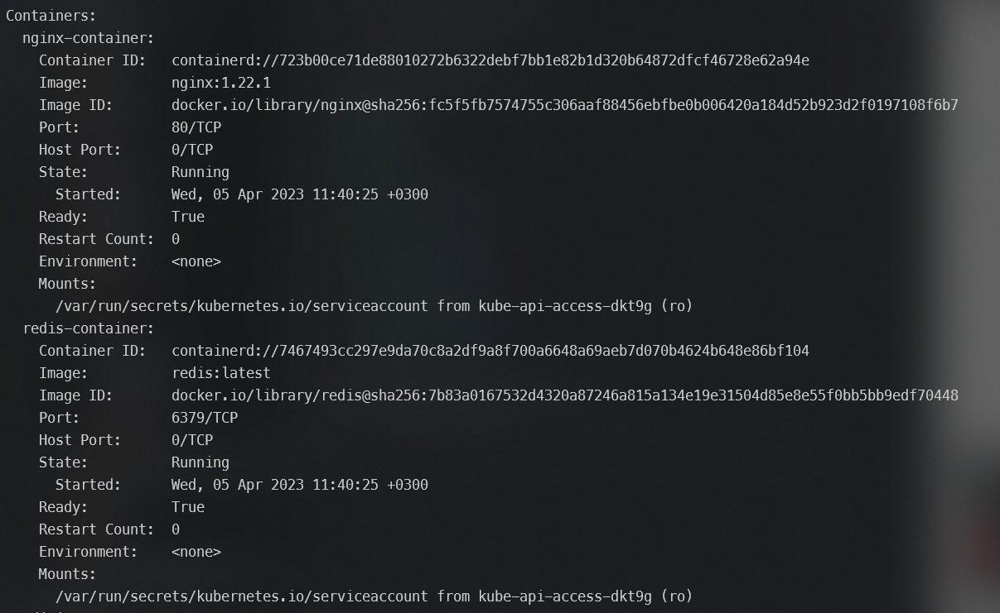

# Kubernetes

---


# Notes

Issues with local ARM based cluster - non comptabile images

Runing on AKS, with one slight issue in [probes_http](#4-probes/**liveness_http**) 

---


## 1. Simple pods operations:

No pods available after querying 


---

While using --all-namespaces we see pods(21) under the kube-system namespace. These pods are made and owned by the cluster - basically services that make using k8s possible 


---

Afte executing *kubectl run nginx --image=nginx* and querying the pod is runing and well.
  

---

Runing *logs* gives information about the pod - version, process status etc
  

---

Using *-o wide* gives us more information including the node where the pod is running
  

---

Using *describe* gives us a detailed state of a pod


---

Container Image is pulled from a microsoft repository or better know as Microsoft Artifact Registry


---

Logs from the metrics container - Errors aren't errors but information(go figure MS logging system)


ToDo:
- What is a pod_nany

---


## 2. Working with pod manifest files:

For the sake of being brief I'll compare both files - wrong and correct versions.
- apiVersion is wrong for pods should be v1 not v11
- Formatting isn't according to yaml standard
- it's spec, not specs - typo
- image redis123 doesn't exist(we get a pull image error), we should check the image repo(Docker hub) for proper naming/version


---

First run and we get a parsing error


---

After the file has been corrected we get another error this time because of the image name


---

And here we have a healthy pod with a container.


---

nginx manifest
```yaml

apiVersion: v1
kind: Pod
metadata:
  name: nginx-pod
  labels:
    app: frontend
spec:
  containers:
  - name: nginx-container
    image: nginx
    ports:
    - containerPort: 80


```

---

Memecache manifest

```yaml
apiVersion: v1
kind: Pod
metadata:
  name: memcached-pod
  labels:
    app: web
spec:
  containers:
  - name: memcached-container
    image: memcached
    ports:
    - containerPort: 11211
    resources:
      requests:
        cpu: 350m
        memory: 150Mi
      limits:
        cpu: 500m
        memory: 250Mi
    restartPolicy: Never
  ```

  Both nignx and memcache running 


## 3. Multicontainer pods

Definition of our multicontainer pod
```yaml
apiVersion: v1
kind: Pod
metadata:
  name: nginredis
  labels:
    app: frontend-backend
spec:
  containers:
  - name: nginx-container
    image: nginx:1.22.1
    ports:
    - containerPort: 80
  - name: redis-container
    image: redis:latest
    ports:
    - containerPort: 6379
```
---

The pod running with two containers inside 


---

Both containers are pulled from their respective image adresses



---

## 4. Probes

- **liveness_exec**

Edited yaml file for probes_exec

```yaml
apiVersion: v1
kind: Pod
metadata:
  labels:
    test: liveness
  name: liveness-exec
spec:
  containers:
    - name: liveness
      image: k8s.gcr.io/busybox
      args:
        - /bin/sh
        - -c
        - touch /tmp/healthy; sleep 30; rm -rf /tmp/healthy; sleep 600
      livenessProbe:
        exec:
          command:
            - cat
            - /tmp/healthy
        initialDelaySeconds: 5
        periodSeconds: 5
```


Running the describe command - no failure yet


---


Getting the failure after 35 seconds.


---

Pod restarts have icremented


- **liveness_http**


```yaml
apiVersion: v1
kind: Pod
metadata:
  labels:
    test: liveness
  name: liveness-http
spec:
  containers:
    - name: liveness
      image: k8s.gcr.io/liveness
      args:
        - /server
      livenessProbe:
        httpGet:
          path: /healthz
          port: 8080
          httpHeaders:
            - name: Custom-Header
              value: Awesome
        initialDelaySeconds: 3
        periodSeconds: 3
```
**healthz is implemented in Go**


Some issues related to running the healthz, might be related to incorrectly configured AKS 


ToDo:
- fix this 

---

- **probes_tcp**


```yaml
apiVersion: v1
kind: Pod
metadata:
  name: liveness-tcp
labels:
  app: goproxy
spec:
  containers:
  - name: goproxy
    image: k8s.gcr.io/goproxy:0.1
    ports:
    - containerPort: 8080
    livenessProbe:
      tcpSocket:
        port: 9999 # 8080 is a valid port
      initialDelaySeconds: 15
      periodSeconds: 20
```

liveness-tcp is up and running


Probe failure due to using port 9999 


---

- **readiness_htpp**

```yaml
apiVersion: v1
kind: Pod
metadata:
  name: readiness-http
  labels:
    app: test
spec:
  containers:
  - name: nginx
    image: nginx
    ports:
    - containerPort: 80
    readinessProbe:
      httpGet:
        path: / 
        port: 80
        httpHeaders:
        - name: Host
          value: myapplication1.com
      initialDelaySeconds: 1
      periodSeconds: 2
      timeoutSeconds: 1
      successThreshold: 1
      failureThreshold: 
```
Pod is up and running


No issues when running the *describe* command.


The pod is running but it's not ready


Due to the change the probe fails.
