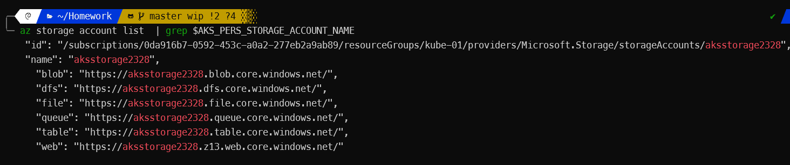
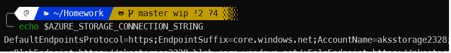
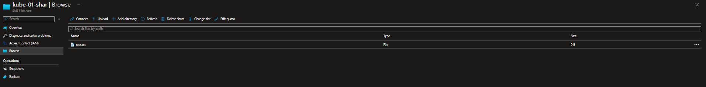

# Kubernetes storage

---


# Notes

Running on AKS using local cli 

k is alias for kubectl

Sorry for the crappy pdf but conversion from markdown to pdf sucks

---


## 1. Direct provisioning of Azure file storage:

```bash

AKS_PERS_STORAGE_ACCOUNT_NAME=aksstorage$RANDOM
AKS_PERS_RESOURCE_GROUP=kube-01
AKS_PERS_LOCATION=eastus
AKS_PERS_SHARE_NAME=kube-01-share

```

- Creating resource groups
Skipping `az group create --name$AKS_PERS_RESOURCE_GROUP --location$AKS_PERS_LOCATION` because of existing resource 


- Creating a storage account
  `az storage account create -n $AKS_PERS_STORAGE_ACCOUNT_NAME -g $AKS_PERS_RESOURCE_GROUP -l$ AKS_PERS_LOCATION --sku Standard_LRS`

- Confirmation of the create storage account



- Exporting connecting string as env
`export AZURE_STORAGE_CONNECTION_STRING=$(az storage account show-connection-string -n $AKS_PERS_STORAGE_ACCOUNT_NAME -g $AKS_PERS_RESOURCE_GROUP -o tsv)`


- connection string


- Creating file share `az storage share create -n $AKS_PERS_SHARE_NAME --connection-string $AZURE_STORAGE_CONNECTION_STRING`

```bash
{
  "created": true
}
```


- Getting storage account key `STORAGE_KEY=$(az storage account keys list --resource-group $AKS_PERS_RESOURCE_GROUP --account-name $AKS_PERS_STORAGE_ACCOUNT_NAME --query"[0].value" -o tsv)`


- Echoing storage account name and key
```bash
echo Storage account name: $AKS_PERS_STORAGE_ACCOUNT_NAME
Storage account name: aksstorage2328

echo Storage account key: $STORAGE_KEY
Storage account key: *******************
Storage account key: m+XJLvRxP7dwnXDJkRba+6rOy6Q2pJeFofz/kuGudCA7G47v7MLbcY0ed/GhBPWE9cgf3W00E562+AStJeu3/Q==
```

---

- Creating kubernetes secret 
```bash
k create secret generic azure-secret --from-\
literal=azurestorageaccountname=$AKS_PERS_STORAGE_ACCOUNT_NAME \
--from-literal=azurestorageaccountkey=$STORAGE_KEY


secret/azure-secret created

```


- Check secret
```bash
k get secret -A

NAMESPACE     NAME                     TYPE                            DATA   AGE
default       azure-secret             Opaque                          2      2m18s
kube-system   ama-logs-secret          Opaque                          2      5d18h
kube-system   bootstrap-token-dm4yg2   bootstrap.kubernetes.io/token   4      5d18h
kube-system   konnectivity-certs       Opaque                          3      5d18h
```


- Creating azure-files-pod.yaml
```yaml
apiVersion: v1
kind: Pod
metadata:
  name: mypod
spec:
  containers:
  - name: mypod
    image: mcr.microsoft.com/oss/nginx/nginx:1.15.5-alpine
    resources:
      requests:
        cpu: "100m"
        memory: "128Mi"
      limits:
        cpu: "250m"
        memory: "256Mi"
    volumeMounts:
    - name: azuremount
      mountPath: /mnt/azure
  volumes:
  - name: azure
    azureFile:
      secretName: azure-secret
      shareName: kube-01-shar
      readOnly: false
```


- Checking on the pod
```bash

k describe pod my pod

Events:
  Type    Reason     Age   From               Message
  ----    ------     ----  ----               -------
  Normal  Scheduled  38s   default-scheduler  Successfully assigned default/mypod to aks-agentpool-41905252-vmss000009
  Normal  Pulling    38s   kubelet            Pulling image "mcr.microsoft.com/oss/nginx/nginx:1.15.5-alpine"
  Normal  Pulled     37s   kubelet            Successfully pulled image "mcr.microsoft.com/oss/nginx/nginx:1.15.5-alpine" in 909.269306ms
  Normal  Created    37s   kubelet            Created container mypod
  Normal  Started    37s   kubelet            Started container mypod

  ```


  - Getting into the container
```bash
k exect -it mypod -- sh #no default bash for alpine
```


- Creating test.txt in the pod
```sh
touch mnt/azure/test.txt
```

- Confirming file in azure portal


---

## 2: Provisioning Azure File storage using PVs and PVCs

- Creating azfile-mount-options-pv
```yaml
apiVersion: v1
kind: PersistentVolume
metadata:
  name: azurefile
spec:
  capacity:
    storage: 5Gi
  accessModes:
    - ReadWriteMany
  azureFile:
    secretName: azure-secret
    shareName: aks-share
    readOnly: false
  mountOptions:
    - dir_mode=0777
    - file_mode=0777
    - uid=1000
    - gid=1000
    - mfsymlinks
    - nobrl
```

5. **Can you use other mode with Azure files ?**
    - yes, ReadWriteOnce, ReadOnlyMany, AzureFile, AzureDisk


- Creating azfile-mount-options-pvc
- 
```yaml
apiVersion: v1
kind: PersistentVolumeClaim
metadata:
  name: azurefile
spec:
  accessModes:
    - ReadWriteMany
  storageClassName: ""
  resources:
    requests:
      storage: 5Gi
```


- Verifying the PVC
```bash
k get pvc azurefile
NAME        STATUS   VOLUME      CAPACITY   ACCESS MODES   STORAGECLASS   AGE
azurefile   Bound    azurefile   5Gi        RWX                           14s
```


- Embedding the pvc into a pod
```yaml
apiVersion: v1
kind: Pod
metadata:
  name: mypod
spec:
  containers:
    - name: mypod
      image: mcr.microsoft.com/oss/nginx/nginx:1.15.5-alpine
      resources:
        requests:
          cpu: 100m
          memory: 128Mi
        limits:
          cpu: 250m
          memory: 256Mi
      volumeMounts:
        - name: azure
          mountPath: /mnt/azure
  volumes:
    - name: azure
      persistentVolumeClaim:
        claimName: azurefile


```

- Pod is running normally 
```bash 
k describe pod mypod


Events:
  Type    Reason     Age    From               Message
  ----    ------     ----   ----               -------
  Normal  Scheduled  8m15s  default-scheduler  Successfully assigned default/mypod to aks-agentpool-41905252-vmss00000a
  Normal  Pulling    8m13s  kubelet            Pulling image "mcr.microsoft.com/oss/nginx/nginx:1.15.5-alpine"
  Normal  Pulled     8m11s  kubelet            Successfully pulled image "mcr.microsoft.com/oss/nginx/nginx:1.15.5-alpine" in 1.132327587s
  Normal  Created    8m11s  kubelet            Created container mypod
  Normal  Started    8m11s  kubelet            Started container mypod

  ```

- Check for test.txt
```sh
k exec -it mypod -- sh

/ # ls /mnt/azure/
test.txt
```

What happens with the azure fileshare ?
  - The file is persistent 

---


## 3. Provisioning AZ file storage using  using Storage Classes

- Creating azure-file-sc

```yaml
kind: StorageClass
apiVersion: storage.k8s.io/v1
metadata:
  name: my-azurefile
provisioner: kubernetes.io/azure-file
mountOptions:
  - dir_mode=0777
  - file_mode=0777
  - uid=0
  - gid=0
  - mfsymlinks
  - cache=strict
  - actimeo=30
parameters:
  skuName: Standard_LRS
  ```


- Creating azulre-file-pvc
```yaml
  apiVersion: v1
kind: PersistentVolumeClaim
metadata:
  name: my-azurefile
spec:
  accessModes:
    - ReadWriteMany
  storageClassName: my-azurefile
  resources:
    requests:
      storage: 5Gi
```


- PVC status check
```bash
k get pvc my-azurefile
NAME           STATUS   VOLUME                                     CAPACITY   ACCESS MODES   STORAGECLASS   AGE
my-azurefile   Bound    pvc-27947ead-22a7-4aa6-97fe-4a9ef5b3084b   5Gi        RWX            my-azurefile   7m
```

- Creating azure-pvc-files
```yamls
apiVersion: v1
kind: Pod
metadata:
  name: mypod
spec:
  containers:
    - name: mypod
      image: mcr.microsoft.com/oss/nginx/nginx:1.15.5-alpine
      resources:
        requests:
          cpu: 100m
          memory: 128Mi
        limits:
          cpu: 250m
          memory: 256Mi
      volumeMounts:
        - name: azure
          mountPath: /mnt/azure
  volumes:
    - name: azure
      persistentVolumeClaim:
        claimName: azurefile
```


- Describe volume claim
```bash

k describe pod my-pod

Volumes:
  volume:
    Type:       PersistentVolumeClaim (a reference to a PersistentVolumeClaim in the same namespace)
    ClaimName:  my-azurefile
    ReadOnly:   false
```

---
 

## 4. Direct provisoning of Azure disk storage

- Getting resource group node
```bash
az aks show --resource-group kube-01 \
--name Kluster-01 \
--query nodeResourceGroup -o tsv

MC_kube-01_Kluster-01_eastus
```

- Disk creation
```bash
az disk create \
--resource-group MC_kube-01_Kluster-01_eastus \
--name myAKSDisk \
--size-gb 20 \
--query id --output tsv

/subscriptions/0da916b7-0592-453c-a0a2-277eb2a9ab89/resourceGroups/MC_kube-01_Kluster-01_eastus/providers/Microsoft.Compute/disks/myAKSDisk
```


- Checking pod - everything mounted properly
```bash
k describe pod mypod
Volumes:
  azure:
    Type:         AzureDisk (an Azure Data Disk mount on the host and bind mount to the pod)
    DiskName:     myAKSDisk
    DiskURI:      /subscriptions/0da916b7-0592-453c-a0a2-277eb2a9ab89/resourceGroups/MC_kube-01_Kluster-01_eastus/providers/Microsoft.Compute/disks/myAKSDisk
```

- Accessing pod
```bash
kubectl exec -it mypod -- sh
/mnt/azure # touch test.txt
/mnt/azure # ls

lost+found  test.txt
```

