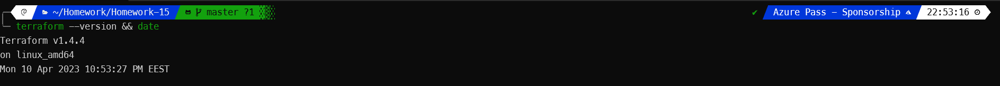

# Terraform 

---


# Notes

azurerm == azure resource manager

Sorry for the crappy pdf but conversion from markdown to pdf sucks

---


## 1. Installing terraform




## 2. Defining first terraform infrastrucute code

- Setting Azurerm

```terraform
terraform {
  required_providers {
    azurrm = {
      source = "hashicorp/azurerm"
      version = "3.51.0"
    }
  }
}

provider "azurerm" {
  # Configuration options
}
```


- Initializing
```bash
terraform init

Terraform has been successfully initialized!
```

- Planning 
```bash
terraform plan

No changes. Your infrastructure matches the configuration.

```