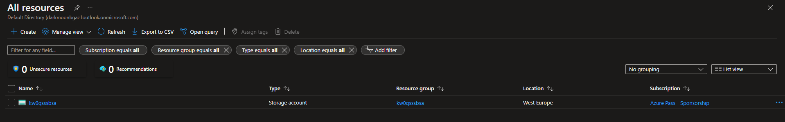

# Terraform 

---


# Notes


Sorry for the crappy pdf but conversion from markdown to pdf sucks

---


## 1. Installing terraform


**side note**
I had issue with exporting the values following [Terraform azure example](https://developer.hashicorp.com/terraform/tutorials/azure-get-started/azure-build), but having the variables seperately rather than hardcoded is better.

```terraform
provider "azurerm" {

  
  client_id       = "8e127a0c-c23a-4ff0-9fd7-13e248d82b39"
  client_secret   = var.az_secret
  tenant_id       = "91949ffb-068b-4c9e-96af-28114a5113a4"
  subscription_id = "0da916b7-0592-453c-a0a2-277eb2a9ab89
```
ToDo:
- [ ] Move everything to a .tfvar

## 2. Defining first terraform infrastrucute code

- Setting Azurerm

```terraform
terraform {
  required_providers {
    azurrm = {
      source = "hashicorp/azurerm"
      version = "3.35.0"
    }
  }
}

provider "azurerm" {
  # Configuration options
}
```


- Initializing
```bash
terraform init

Terraform has been successfully initialized!
```

- Planning:
  Getting an error because we don't have enough features. [Features](https://registry.terraform.io/providers/hashicorp/azurerm/latest/docs/guides/features-block) is actually a block that gives extra configurations
```bash
terraform plan

╷
│ Error: Insufficient features blocks
│ 
│   on main.tf line 12, in provider "azurerm":
│   12: provider "azurerm" {
│ 
│ At least 1 "features" blocks are required.
╵

```

- After adding the missing block and reruing terraform plan.
```bash
terraform plan

No changes. Your infrastructure matches the configuration.
```

---

- Changing to older version
```go
version = "3.35.0"
```

- Adding the example code block
```go
resource "random_string" "random" {
  length  = 8
  special = 8
  lower   = true
  upper   = false
}

resource "azurerm_resource_group" "example" {
  name     = "${random_string.random.result}sa"
  location = "West Europe"
}

resource "azurerm_storage_account" "example" {
  name                     =  "${random_string.random.result}sa"
  resource_group_name      = azurerm_resource_group.example.name
  location                 = azurerm_resource_group.example.location
  access_tier              = "Standard"
  account_replication_type = "GRS"
  blob_properties {
    restore_policy {
      days = 7
    }
  }
  tags = {
    "enviorment" = "staging"
  }
}
```

- Executing plan: because of the version change we get some inconsistency. This is fixed by using terraform init -upgrade
```bash
terrafom plan

│ Error: Inconsistent dependency lock file
```


- After running `terraform plan` we get another error. Checking the documentation for version[3.35.0](https://registry.terraform.io/providers/r-t-m/azurerm/3.35.0/docs/data-sources/storage_account) restore_policy is missing.
```bash
│ Error: Unsupported block type
│ 
│   on main.tf line 43, in resource "azurerm_storage_account" "example":
│   43:     restore_policy {
│ 
│ Blocks of type "restore_policy" are not expected here.
```


- Adding automatic update with a minimum version
`">=3.36.0"`


- Another error, this time missing policies. 


```bash
Error: Missing required argument
│ 
│   with azurerm_storage_account.example,
│   on main.tf line 43, in resource "azurerm_storage_account" "example":
│   43:     restore_policy {
│ 
│ "blob_properties.0.restore_policy": all of
│ `blob_properties.0.delete_retention_policy,blob_properties.0.restore_policy`
│ must be specified
```

Checking documentation we can see that, which coresponds to our error.
```text
restore_policy - (Optional) A restore_policy block as defined below.
This must be used together with delete_retention_policy set, 
versioning_enabled and change_feed_enabled set to true.
```


- After fixing everything we get an output

```terraform
# azurerm_resource_group.example will be created
  + resource "azurerm_resource_group" "example" {
      + id       = (known after apply)
      + location = "westeurope"
      + name     = (known after apply)
    }

  # azurerm_storage_account.example will be created
  + resource "azurerm_storage_account" "example" {
      + access_tier                       = (known after apply)
      + account_kind                      = "StorageV2"
      + account_replication_type          = "GRS"
      + account_tier                      = "Standard"
      + allow_nested_items_to_be_public   = true
      + cross_tenant_replication_enabled  = true
      + default_to_oauth_authentication   = false
      + enable_https_traffic_only         = true
      + id                                = (known after apply)
      + infrastructure_encryption_enabled = false
      + is_hns_enabled                    = false
      + large_file_share_enabled          = (known after apply)
      + location                          = "westeurope"
      + min_tls_version                   = "TLS1_2"
      + name                              = (known after apply)
      + nfsv3_enabled                     = false
      + primary_access_key                = (sensitive value)
      + primary_blob_connection_string    = (sensitive value)
      + primary_blob_endpoint             = (known after apply)
      + primary_blob_host                 = (known after apply)
      + primary_connection_string         = (sensitive value)
      + primary_dfs_endpoint              = (known after apply)
      + primary_dfs_host                  = (known after apply)
      + primary_file_endpoint             = (known after apply)
      + primary_file_host                 = (known after apply)
      + primary_location                  = (known after apply)
      + primary_queue_endpoint            = (known after apply)
      + primary_queue_host                = (known after apply)
      + primary_table_endpoint            = (known after apply)
      + primary_table_host                = (known after apply)
      + primary_web_endpoint              = (known after apply)
      + primary_web_host                  = (known after apply)
      + public_network_access_enabled     = true
      + queue_encryption_key_type         = "Service"
      + resource_group_name               = (known after apply)
      + secondary_access_key              = (sensitive value)
      + secondary_blob_connection_string  = (sensitive value)
      + secondary_blob_endpoint           = (known after apply)
      + secondary_blob_host               = (known after apply)
      + secondary_connection_string       = (sensitive value)
      + secondary_dfs_endpoint            = (known after apply)
      + secondary_dfs_host                = (known after apply)
      + secondary_file_endpoint           = (known after apply)
      + secondary_file_host               = (known after apply)
      + secondary_location                = (known after apply)
      + secondary_queue_endpoint          = (known after apply)
      + secondary_queue_host              = (known after apply)
      + secondary_table_endpoint          = (known after apply)
      + secondary_table_host              = (known after apply)
      + secondary_web_endpoint            = (known after apply)
      + secondary_web_host                = (known after apply)
      + sftp_enabled                      = false
      + shared_access_key_enabled         = true
      + table_encryption_key_type         = "Service"
      + tags                              = {
          + "enviorment" = "staging"
        }

      + blob_properties {
          + change_feed_enabled      = true
          + default_service_version  = (known after apply)
          + last_access_time_enabled = false
          + versioning_enabled       = true

          + delete_retention_policy {
              + days = 8
            }

          + restore_policy {
              + days = 7
            }
        }
    }

  # random_string.random will be created
  + resource "random_string" "random" {
      + id          = (known after apply)
      + length      = 8
      + lower       = true
      + min_lower   = 0
      + min_numeric = 0
      + min_special = 0
      + min_upper   = 0
      + number      = true
      + numeric     = true
      + result      = (known after apply)
      + special     = false
      + upper       = false
    }
```


1. How many resources have you defined in your code and how many resources does the plan output show? Are they the same and why?
- Three resources were define - resource group, storage and random. Random is some kind of helper resource that is used in this case for random names and the other resources are resources that will be provisioned on Azure

2. What is the location of your resource group and what is the location of the storage account?
- West Europe

3. How many resources do you have on your subscription? (To list all resources, type “All resources” in the search bar on the top in Azure Portal)
- One the storage account

4. Are the number of resources shown in the All resources portal window the same with the ones from your plan?

5. Give short explanation about the resources that are not shown?

6. Provide print screen of your portal with all resources.


---


## 3. Using variables and otuputs

- adding variables
```terraform

variable "my_name" {
  type = string
  description = "First name of the student"
}

variable "location" {
  type = string
  description = "Location"
  default = "West Europe"
}

```

- Changing variables in main

```terraform
 resource "azurerm_resource_group" "example" {
  name     = "${var.my_name}-${random_string.random.result}sa"
  location = var.location
}
```

1. How many variables do we have defined and which are they ?
   - Two variables: my_name and location
2. Why did Terraform asked us to input my_name variable
   - because the variable doesn't have a value assigned to it 


- Adding tf variables
```bash
terraform plan --var-file=account.tfvars inputs.tfvars

Plan: 2 to add, 0 to change, 2 to destroy.
```