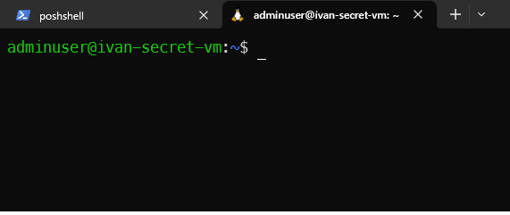
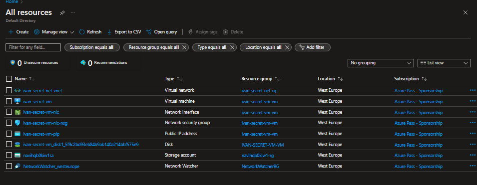

# Terraform modules

---


# Notes

.tfvars will not be uploaded for secuirty reasons

Sorry for the crappy pdf but conversion from markdown to pdf sucks

---


## 1. Setting up remote backend
    1. Provision storage container for terraform state
  

    2. Backend config
  ```terraform
        
        resource_group_name =  "navihqb0kiw1-rg"
        azurerm_storage_account = "navihqb0kiw1sa"
        container_name = "tfstate"
        key = "ivan.tfstate"
  ```
    3. Succsessful backend initialization
   
  ```bash
        
        terraform init -backend-config=backend/ivan_env_backend.tf

        Initializing the backend...

        Successfully configured the backend "azurerm"! Terraform will automatically
        use this backend unless the backend configuration changes.

        Initializing provider plugins...
        - Reusing previous version of hashicorp/azurerm from the dependency lock file
        - Using previously-installed hashicorp/azurerm v3.53.0

        Terraform has been successfully initialized!
  ```   
---

## 2 Provision infra from midterm assignment
  1. Local variables tf and tfvars
   ```bash
  #Variable declaration

  variable "my_name" {
  type        = string
  description = "user name for resource creation"
}

variable "enviorment" {
  type = string
}

variable "location" {
  type        = string
  description = "resource location"
       
   #Variable definition   

  my_name = "ivan"

  enviorment = "secret"

  location = "West Europe

   ```
  2. General network resources

  ```bash
  resource "azurerm_resource_group" "general_network" {
  name     = "${local.network_base_name}-rg"
  location = var.location
}


resource "azurerm_virtual_network" "general_network" {
  name                = "${local.network_base_name}-vnet"
  location            = azurerm_resource_group.general_network.location
  resource_group_name = azurerm_resource_group.general_network.name
  address_space       = ["10.0.0.0/16"]
}

resource "azurerm_subnet" "general_network_vms" {
  name                 = "${azurerm_virtual_network.general_network.name}-vms-snet"
  resource_group_name  = azurerm_resource_group.general_network.name
  virtual_network_name = azurerm_virtual_network.general_network.name
  address_prefixes     = ["10.0.1.0/24"]
}
```

  3. Terraform plan 
   ```bash
   Terraform will perform the following actions:

  # azurerm_resource_group.general_network will be created
  + resource "azurerm_resource_group" "general_network" {
      + id       = (known after apply)
      + location = "westeurope"
      + name     = "ivan-secret-net-rg"
    }

  # azurerm_subnet.general_network_vms will be created
  + resource "azurerm_subnet" "general_network_vms" {
      + address_prefixes                               = [
          + "10.0.1.0/24",
        ]
      + enforce_private_link_endpoint_network_policies = (known after apply)
      + enforce_private_link_service_network_policies  = (known after apply)
      + id                                             = (known after apply)
      + name                                           = "ivan-secret-net-vnet-vms-snet"
      + private_endpoint_network_policies_enabled      = (known after apply)
      + private_link_service_network_policies_enabled  = (known after apply)
      + resource_group_name                            = "ivan-secret-net-rg"
      + virtual_network_name                           = "ivan-secret-net-vnet"
    }

  # azurerm_virtual_network.general_network will be created
  + resource "azurerm_virtual_network" "general_network" {
      + address_space       = [
          + "10.0.0.0/16",
        ]
      + dns_servers         = (known after apply)
      + guid                = (known after apply)
      + id                  = (known after apply)
      + location            = "westeurope"
      + name                = "ivan-secret-net-vnet"
      + resource_group_name = "ivan-secret-net-rg"
      + subnet              = (known after apply)
    }

Plan: 3 to add, 0 to change, 0 to destroy.
```
   

4. Successful provision

   

---

## Task 3 Virtual machines and modules
   1.  Module variables
```bash
variable "base_name" {
  type        = string
  description = "vm based name"
}
variable "vms_subnet_id" {
  type        = string
  description = "subnet id "
}
variable "my_public_ip" {
  type = string
}
description = "my public ip"

variable "my_password" {
  type        = string
  description = "password"
}
variable "location" {
  type        = string
  description = "azure region"
}
```
2. Module definitions
```bash
locals {}

resource "azurerm_resource_group" "vm-rg" {}

resource "azurerm_public_ip" "vm-pip" {}

resource "azurerm_network_interface" "vm-nic" {}

resource "azurerm_network_security_group" "vm-nsg" {}

resource "azurerm_network_interface_security_group_association" "vm_nsg_to_vm_nic" {}

resource "azurerm_linux_virtual_machine" "web_srv" {}

```

3. Hello from the VM



4. Overview of AZ reousrces



---