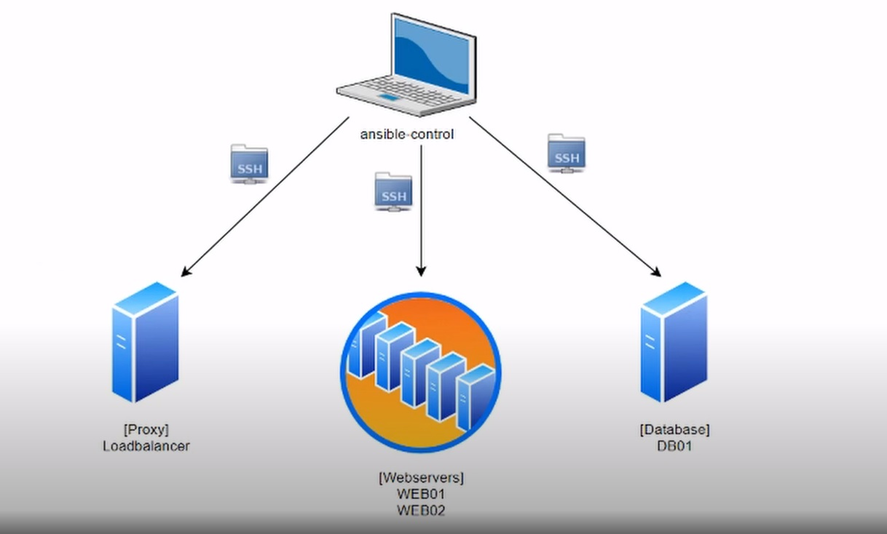

# Ansible Lab 1 - Installation and Inventory file basics

Every beginning is difficult, and I hope you made it with the installations. The first lab is intended to set up the vagrant infrastructure you'll need to learn Ansible.



As shown in the image above, our Ansible control will come from ansible-control through which we will be able to ssh and orchestrate the other machines.

1. ### Create VMs using vagrant and ssh to our control server
    The following commands will setup Vagrant and connect to ansible-control server
    ``` shell
     vagrant up --provider virtualbox
     vagrant ssh ansible-control
    ```
2. ### Copy /vagrant/hosts_file to /etc/hosts
    The below command will copy hosts file on ansible-control
    ``` shell
    sudo cp /vagrant/hosts_file /etc/hosts
    ```
3. ### Install ansible
    Since we are now connected to the ansible-control machine we can install Ansible with:
    ``` shell
     sudo apt update
     sudo apt install ansible -y
    ```
4. ### Create an inventory file named hosts
    With this command you will copy the pre-defined hosts file:
    ``` shell
    sudo cp /vagrant/ansible-lab1/hosts /home/vagrant/hosts
    ```
5. ### Test out a command
    ``` shell
     ansible localhost -m command -a hostname
     ansible localhost -m command -a date
    ```
6. ### Generate SSH Keys and copy to hosts
     Run the below commands to create a SSH key and copy to all servers
    ``` shell
    ssh-keygen
    ssh-copy-id localhost
    ssh-copy-id web01 && ssh-copy-id web02 && ssh-copy-id loadbalancer && ssh-copy-id db01
    ```
    Note: Type yes to confirm and If it prompt for password it is the SSH pass which is: vagrant

7. ### Test running ad-hoc commands to all hosts
    Now we can run an ad-hoc command to the webstack group that we created and set
    ``` shell
    ansible webstack -i /home/vagrant/hosts -m command -a hostname
    ```
You just set up a hostfile, installed ansible on ansible-control, generated an ssh key, and copied it to all virtual machines.


