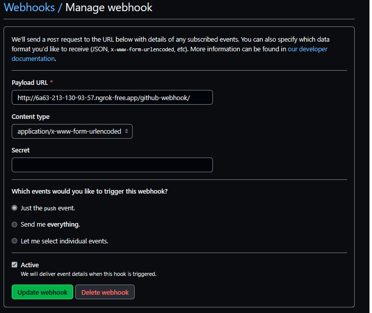
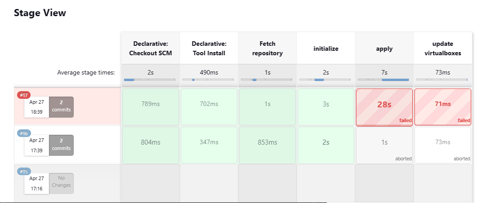

# Jenkins CI

---


# Notes

Creating a Terraform pipeline that provisions VMs using Jenkins

Sadly wsl2 doesn't provide nested VMs and deployment fails

Sorry for the crappy pdf but conversion from markdown to pdf sucks

---


1. Creating terraform files
  
  ```terraform
   terraform {
  required_providers {
    virtualbox = {
      source = "terra-farm/virtualbox"
      version = "0.2.2-alpha.1"
    }
  }
}

 # There are currently no configuration options for the provider itself.

resource "virtualbox_vm" "node" {
  count     = 3
  name      = format("node-%02d", count.index + 1)
  image     = "https://app.vagrantup.com/ubuntu/boxes/bionic64/versions/20180903.0.0/providers/virtualbox.box"
  cpus      = 2
  memory    = "512 mib"
  status = "poweroff"


  network_adapter {
    type           = "hostonly"
    host_interface = "vboxnet1"
  }
}

output "IPAddr" {
  value = element(virtualbox_vm.node.*.network_adapter.0.ipv4_address, 1)
}

output "IPAddr_2" {
  value = element(virtualbox_vm.node.*.network_adapter.0.ipv4_address, 2)
}

  ```


2. Creating Jenkins script

  ```groovy
pipeline {
    tools {
        terraform 'terraform'
        }
  triggers {
       githubPush()
    }
    agent any

    stages {
        stage('Fetch repository') {
            steps {
                sh 'pwd'
            }
        }
        stage('initialize') {
            steps {
                    dir('Homework-19') {
                        sh 'pwd'
                        sh 'ls'
                        sh 'terraform init'
                    }
            }
        }
        stage('apply') {
            steps {
                dir('Homework-19') {
                     sh 'terraform apply -auto-approve'
                }
            }
        }
        stage('update virtualboxes') {
            steps {
                sh 'ansible'
            }
        }
    }
}
```


3. Setting up Github hooks
   - Using ngrok for estableshing a tunnel with the local jenkins server
  


4. Running the pipes

