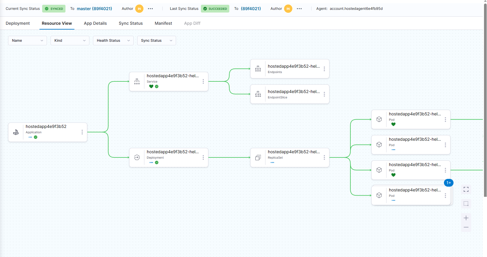

# ArgoCD

---

# Notes

Sorry for the crappy pdf but conversion from markdown to pdf sucks

Using ArgoCD for continious delivery on a kubernetes kluster. 
Demo application is [guest-book](https://github.com/nikolaev-i/ArgoOps/tree/master/helm-guestbook)

---

- Current status of kluster
   - running two replica sets everything in sync

  

- changes to the master branch
  - increasing replicas 
  - 
  

- Syncing the deployed cluster with the master branch
  