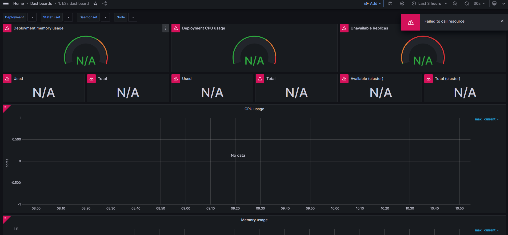
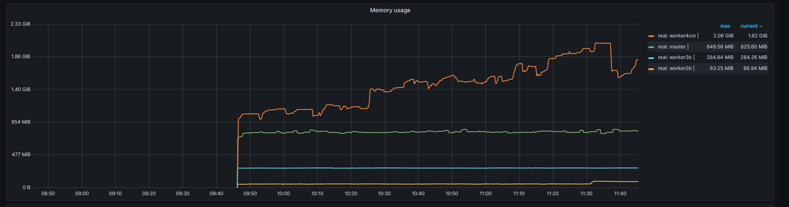
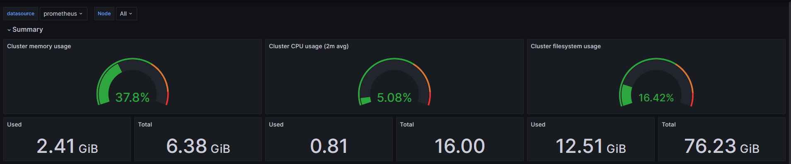

# Kubernetes monitoring with prometheus and grafana

---


# Notes

Using homemade kluster with prometheus and windows machine for grafana

Sorry for the crappy pdf but conversion from markdown to pdf sucks

---


## 1. Setting up prometheus
- creating a monitoring namespace
  ```bash
     k get namespaces

     NAME              STATUS   AGE
     default           Active   47d
     kube-system       Active   47d
     kube-public       Active   47d
     kube-node-lease   Active   47d
     mqtt              Active   46d
     monitoring        Active   7s
  ```

- creating kluster role for prometheus using 

  ```bash
    k create -f clusterRole.yaml
    clusterrole.rbac.authorization.k8s.io/prometheus created
    clusterrolebinding.rbac.authorization.k8s.io/prometheus created
  ```

  - creating konfig map 
  ```bash
     kubectl create -f config-map.yaml
     configmap/prometheus-server-conf created
  ```


- changes to prometheus-deployment.yaml adding selector node for arm64 since the rpi4 has more memory
  ```yaml
        nodeSelector:
          kubernetes.io/arch: arm64
  ```

- deploying prometheus
  ```bash
  kubectl create  -f prometheus-deployment.yaml 
  deployment.apps/prometheus-deployment created
  
  kubectl get deployments --namespace=monitoring
  NAME                                     READY   STATUS    RESTARTS      AGE
  prometheus-deployment-7cd478cf54-jrf24   1/1     Running   1 (12s ago)   96s
  ```

2. Setting up Grafana
  - konfig map yaml
  ```yaml
  apiVersion: v1
kind: ConfigMap
metadata:
  name: grafana-datasources
  namespace: monitoring
data:
  prometheus.yaml: |-
    {
        "apiVersion": 1,
        "datasources": [
            {
               "access":"proxy",
                "editable": true,
                "name": "prometheus",
                "orgId": 1,
                "type": "prometheus",
                "url": "http://prometheus-service.monitoring.svc:8080",
                "version": 1
            }
        ]
    }
  ```
- applying the konfing map

```bash
kubectl create -f grafana-datasource-config.yaml

configmap/grafana-datasources created
```
- creating grafana-deployment.yaml changing limit
  ```yaml
  limits:
            memory: 500M
            cpu: "1000m"
          requests: 
            memory: 500M
            cpu: "500m"
  ```
- applying grafana-deployment.yaml


- running grafana with the suggested dashboard, source issues occured



- checking the prometheus source in grafana, we see this 
  ```Error reading Prometheus: Post "http://prometheus-service.monitoring.svc:8080/api/v1/query": dial tcp: lookup prometheus-service.monitoring.svc on 10.43.0.10:53: no such host```

Which might suggest the service isn't running.

- checking running services - the prometheus service isn't running in the monitoring
```bash
k get svc -n monitoring
NAME      TYPE       CLUSTER-IP     EXTERNAL-IP   PORT(S)          AGE
grafana   NodePort   10.43.60.154   <none>        3000:32000/TCP   27m
```

- checking previous steps it seems the service step was forgotten
```bash
 k apply -f prometheus-service.yaml --namespace=monitoring
deployment.apps/prometheus-service created
```

- checking data source from grafana
  ```Data source is working```


- live dashboard






