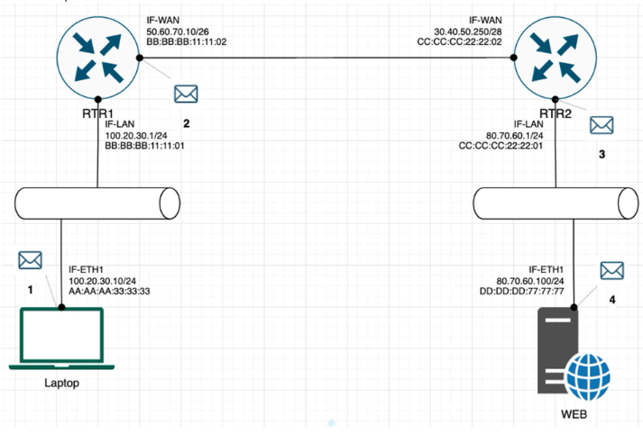

# Exercise 1 - Basic Networking

- **arp -a** 


```
Interface: 192.168.56.1 --- 0x10 
  Internet Address      Physical Address      Type
  192.168.56.255        ff-ff-ff-ff-ff-ff     static
  224.0.0.2             01-00-5e-00-00-02     static
  224.0.0.22            01-00-5e-00-00-16     static
  224.0.0.251           01-00-5e-00-00-fb     static
  224.0.0.252           01-00-5e-00-00-fc     static
  239.255.255.250       01-00-5e-7f-ff-fa     static
  255.255.255.255       ff-ff-ff-ff-ff-ff     static

Interface: 192.168.1.119 --- 0x21
  Internet Address      Physical Address      Type
  192.168.1.1           00-5f-67-55-ba-30     dynamic
  192.168.1.7           6a-2c-c5-06-fd-e1     dynamic
  192.168.1.127         00-d8-61-fc-1c-44     dynamic
  192.168.1.255         ff-ff-ff-ff-ff-ff     static
  224.0.0.2             01-00-5e-00-00-02     static
  224.0.0.22            01-00-5e-00-00-16     static
  224.0.0.251           01-00-5e-00-00-fb     static
  224.0.0.252           01-00-5e-00-00-fc     static
  239.255.255.250       01-00-5e-7f-ff-fa     static
  255.255.255.255       ff-ff-ff-ff-ff-ff     static

Interface: 172.22.240.1 --- 0x40
  Internet Address      Physical Address      Type
  172.22.242.27         00-15-5d-24-73-63     dynamic
  172.22.255.255        ff-ff-ff-ff-ff-ff     static
  224.0.0.2             01-00-5e-00-00-02     static
  224.0.0.22            01-00-5e-00-00-16     static
  224.0.0.251           01-00-5e-00-00-fb     static
  239.255.255.250       01-00-5e-7f-ff-fa     static
```
---

- **route PRINT**

```
IPv4 Route Table
===========================================================================
Active Routes:
Network Destination        Netmask          Gateway       Interface  Metric
          0.0.0.0          0.0.0.0      192.168.1.1    192.168.1.119     25
        127.0.0.0        255.0.0.0         On-link         127.0.0.1    331
        127.0.0.1  255.255.255.255         On-link         127.0.0.1    331
  127.255.255.255  255.255.255.255         On-link         127.0.0.1    331
     172.22.240.0    255.255.240.0         On-link      172.22.240.1    271
     172.22.240.1  255.255.255.255         On-link      172.22.240.1    271
   172.22.255.255  255.255.255.255         On-link      172.22.240.1    271
      192.168.1.0    255.255.255.0         On-link     192.168.1.119    281
    192.168.1.119  255.255.255.255         On-link     192.168.1.119    281
    192.168.1.255  255.255.255.255         On-link     192.168.1.119    281
     192.168.56.0    255.255.255.0         On-link      192.168.56.1    281
     192.168.56.1  255.255.255.255         On-link      192.168.56.1    281
   192.168.56.255  255.255.255.255         On-link      192.168.56.1    281
        224.0.0.0        240.0.0.0         On-link         127.0.0.1    331
        224.0.0.0        240.0.0.0         On-link      192.168.56.1    281
        224.0.0.0        240.0.0.0         On-link     192.168.1.119    281
        224.0.0.0        240.0.0.0         On-link      172.22.240.1    271
  255.255.255.255  255.255.255.255         On-link         127.0.0.1    331
  255.255.255.255  255.255.255.255         On-link      192.168.56.1    281
  255.255.255.255  255.255.255.255         On-link     192.168.1.119    281
  255.255.255.255  255.255.255.255         On-link      172.22.240.1    271
===========================================================================
```
---

- **google dns server**


```
tracert 8.8.8.8

Tracing route to dns.google [8.8.8.8]
over a maximum of 30 hops:

  1    <1 ms    <1 ms    <1 ms  192.168.1.1
  2     1 ms     1 ms    <1 ms  10.110.0.2
  3     *        *        *     Request timed out.
  4     *        *        *     Request timed out.
  5     9 ms     9 ms     9 ms  212-39-66-222.ip.btc-net.bg [212.39.66.222]
  6    10 ms    10 ms    10 ms  216.239.62.49
  7     9 ms    11 ms     9 ms  209.85.254.243
  8     9 ms     8 ms     8 ms  dns.google [8.8.8.8]
  ```

---

- **Why would you need to use the ping command ?** 
```
     Checking if the host is alive, latency, troubleshooting connection, PoD(ping of death)
```
---

| Protocol          | TCP | UDP | PORT  |
| ----------------- | --- | --- | ----- |
| HTTP              | x   |     | 80    |
| SNMP              |     | x   | 161   |
| HTTPS             | x   |     | 443   |
| DNS Client        |     | x   | 53    |
| DNS Zone Transfer | x   |     | 53    |
| SMTP              | x   |     | 587   |
| SSH               | X   |     | 22    |
| TELNET            | x   |     | 23    |
| FTP               | x   |     | 20,21 |
| MYSQL             | x   |     | 3306  |
| MSSQL             | x   |     | 1433  |
| PostresSQL        | x   |     | 5432  |
| RDP               | x   |     | 3389  |
| NTP               |     | x   | 123   |
| NFS               | x   |     | 2049  |

---

# Exercise 2 – TCP/IP Basics: 
---
*Refer to the exhibit and answer the questions below. The letter symbol ✉, represents the IP packet as it travels across the network.  In the example shown, the laptop attempts to communicate with the web server in question. During its travel the packet will be forwarded across the network nodes and will eventually end up across six network interfaces before it reaches the web server. Each packet as part of the TCP/IP Stack contains fields for the source and destination MAC Address, IP Address and the TCP/UDP Port.*

---



**For each of the packet locations shown, 1 to 4 write down the source and destination MAC addresses of the packet as it travels across the network interfaces.**

   1. The laptop initiates communication with the web server and prepares a packet. What would the packet look like at this stage?
       - SRC IP 100.20.30.10
       - DST IP 80.70.60.100
       - SRC MAC AA:AA:AA:33:33:33
       - DST MAC BB:BB:BB:11:11:01

   2. RTR1 receives the packet on its IF-LAN interface, prepares it accordingly and forwards it out its IF-WAN. What would the packet look like at this stage?
       - SRC IP 100.20.30.10
       - DST IP 80.70.60.100
       - SRC MAC BB:BB:BB:11:11:02
       - DST MAC CC:CC:CC:22:22:02


   3. RTR2 receives the packet on its IF-WAN interface, prepares it accordingly and forwards it out via IF-LAN. What would the packet look like at this stage?
       - SRC IP 100.20.30.10
       - DST IP 80.70.60.100
       - SRC MAC CC:CC:CC:22:22:01
       - DST MAC DD:DD:DD:77:77:77


    4. The web server receives the packet and prepares a response packet back. What would the packet look like at this stage? 
       - SRC IP 80.70.60.100
       - DST IP 100.20.30.10
       - SRC MAC DD:DD:DD:77:77:77
       - DST MAC CC:CC:CC:22:22:01


**Since we are talking about web traffic (www) in the example, which transport layer protocol will most probably be used?**

- [x] TCP
- [ ] UDP


**If we do a traffic analysis with a network packet monitoring tool like WireShark, what can we expect to see for the source and destination ports when the laptop sends the packet?**
- SRC PORT: ephemeral port
- DST PORT: well-know port


**Similarly, and vice versa, what can we expect to see as destination ports when the Web server sends a response packet back?**
- SRC PORT: well-know port
- DST PORT: ephemeral port

**How many broadcast domains are there in the exhibit shown?** 
- 4 broadcast domains

# Exercise 3 – Traffic analysis and identifying the OSI layers of the network packets


