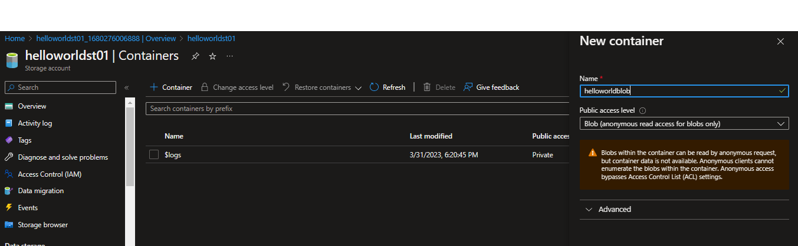

# Mideterm-exam
###Premise
---

#Research/Notes

---

#Tasks

---

1. Host a static website on Blob Storage: build and deploy a static Hello World website to Azure Storage.
  
  
  **creating a blob storage**

**uploading index.html**

**enabling static blob webpages with index.html**

**site hosted on static blob**

*Note first enable static webpage, then upload to created container, not vice versa*

---

2. In this exercise we will setup a Linux based web server and will deploy a web page on it. 

**getting the vnet ready, using default settings**

---

**setting inbound rules for local ssh access**

---

**Testing for ssh acces from my phone using the telecom network**

---

**accessing the vm from my laptop via ssh**

---

**setting up apache web server using the provided tutorial**

---

**vimming the html file**

---

**phone test accessing only from the internal wifi network(disregard the 4G icon)**

---

**update inbound rules because of connectivity issues(allegedly)**

---
